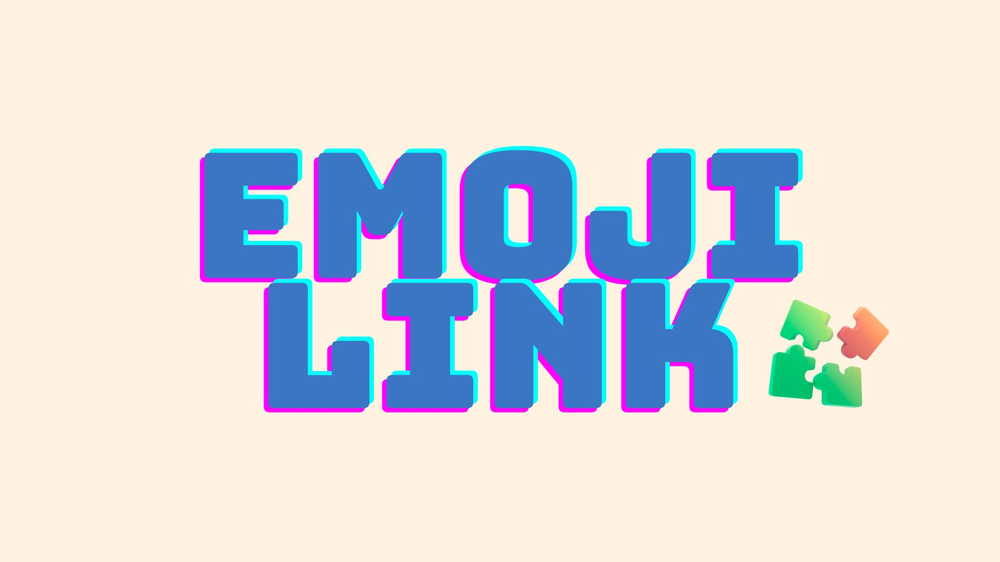

## 🧩 Emoji Link
サービスURL：https://emoji-link.com/

## 目次
* [サービス概要](https://github.com/Takeshi-Yamada/emoji?tab=readme-ov-file#-%E3%82%B5%E3%83%BC%E3%83%93%E3%82%B9%E6%A6%82%E8%A6%81)
* [開発背景](https://github.com/Takeshi-Yamada/emoji?tab=readme-ov-file#%EF%B8%8F-%E9%96%8B%E7%99%BA%E8%83%8C%E6%99%AF)
* [利用イメージ](https://github.com/Takeshi-Yamada/emoji?tab=readme-ov-file#-%E5%88%A9%E7%94%A8%E3%82%A4%E3%83%A1%E3%83%BC%E3%82%B8)
* [使用技術](https://github.com/Takeshi-Yamada/emoji?tab=readme-ov-file#%EF%B8%8F-%E4%BD%BF%E7%94%A8%E6%8A%80%E8%A1%93)
* [ER図](https://github.com/Takeshi-Yamada/emoji?tab=readme-ov-file#-er%E5%9B%B3)

## ❓ サービス概要
～絵文字を繋げてお題を表現しよう！～

「EmojiLink」は自分で決めたお題を絵文字だけで表現しクイズとして投稿できるゲームアプリです。
他のユーザーが投稿したクイズを、絵文字を手掛かりにお題を当ててみよう！
漫画・アニメ・映画などを絵文字で表現することで、絵文字表現の幅を広げるきっかけにもなります。

## ⛏️ 開発背景
ゲームを作った背景：

私はボードゲームが好きで、初心者🔰の方に何を遊んでもらうのがいいのかと考えていました。
世の中に素敵なボドゲはたくさんあり、何を進めればいいのか…？と悩むことが多かったですが、自分が作ってしまおう！となったのがきっかけです。

絵文字をテーマにした背景：

自分が入学したエンジニアスクール🏫では同期や先輩後輩とのテキストコミュニケーションも多く、文字だけだと淡白で絵文字を使うことが増えました。
絵文字をテーマにしたアプリを開発することで絵文字に詳しくなり、柔らかいコミュニケーションができるようになるのではないかと考えたためです。

## 🎮 利用イメージ
* 🔒 **ログイン機能**：
  問題の作成・編集はログインしたユーザーのみ可能です。

* 📝 **クイズを作る**：
  「📓🍎👿」のように、絵文字だけで問題を作成できます（例: デスノート）。

* 🎮 **クイズに答える**：
  他のユーザーが作った絵文字クイズに挑戦できます。

* 👁 **マイページ**：
  自分が作成したクイズと過去の回答やログイン履歴が確認できます。

## ⚙️ 使用技術

| カテゴリ         | 技術内容                                         |
| ------------ | -------------------------------------------- |
| サーバーサイド      | Ruby on Rails 8.0.3・Ruby 3.3.6               |
| フロントエンド      | Ruby on Rails・JavaScript                     |
| 開発環境           | Docker
| CSSフレームワーク   | Tailwind CSS                       |
| Web API      | OpenAI API(gpt-4o-mini)・Google API・cloudinary |
| データベースサーバー   | PostgreSQL                                   |
| インフラ | Fly.io                                       |
| CI/CD   | GitHub Actions                             |
| その他   | Alpine.js/tagify/pango/cairo/rubocop   |

## 🎨 ER図
https://miro.com/app/board/uXjVIu0I3gM=/
